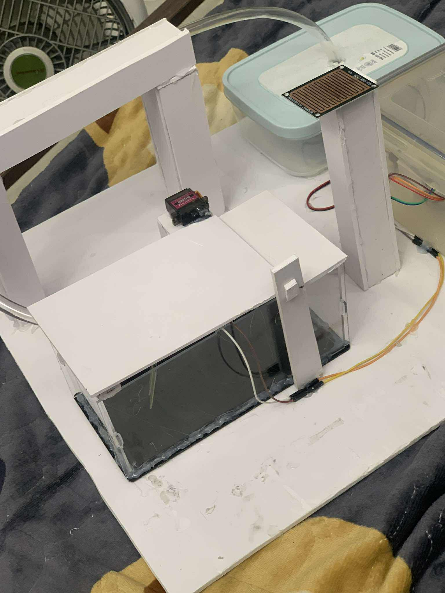
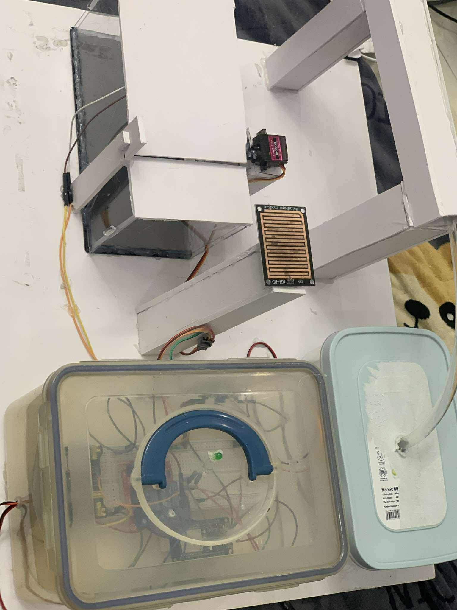

# Automatic Plant Watering System

This repository contains the C++ source code and hardware documentation for an automated, microcontroller-based plant watering prototype. The system is designed to maintain optimal plant hydration by utilizing environmental sensors and motorized mechanisms to manage water distribution autonomously.

## Project Overview

The prototype features a custom-built structural frame that houses the control electronics, a water reservoir, and a sensor array. By processing environmental data (such as moisture and rain detection), the system controls a servo motor to actuate a protective mechanism and manages water flow through the connected tubing.

### Key Features
* **C++ Codebase:** Efficient control logic execution on the microcontroller.
* **Automated Control Logic:** Processes environmental conditions to determine precise watering requirements.
* **Servo-Actuated Mechanism:** Utilizes a TowerPro MG90S servo to control physical components, such as a diverter or protective cover.
* **Rain and Moisture Detection:** Incorporates an MH-RD Raindrops module to inhibit watering during natural precipitation.
* **Enclosed Electronics:** Breadboard-based circuitry housed within a transparent, protective enclosure.

## Hardware Components

The physical prototype incorporates the following hardware:
* **Microcontroller:** ESP32-WROOM32 housed in the main control enclosure.
* **Sensors:** MH-RD Raindrops module and moisture sensor panel.
* **Actuator:** TowerPro MG90S Micro Servo.
* **Water Delivery:** Water reservoir, tubing, and a miniature water pump.
* **Circuitry:** Breadboard, jumper wires, resistors, and LED status indicators.
* **Chassis:** Custom-fabricated foam board and plastic frame.

## Project Gallery

*Overview of the automatic watering system, water reservoir, and structural frame.*

*Top-down perspective showing the water tubing, servo motor, and control enclosure.*

*Detailed view of the MH-RD raindrops sensor module and the protected breadboard enclosure.*

*Detailed view of the TowerPro MG90S servo motor actuating the custom mechanism.*

## Setup and Installation

1. **Hardware Assembly:** 
   * Connect the servo motor, pump, and MH-RD sensor to the ESP32 microcontroller using the breadboard.
   * Assemble the chassis and route the tubing securely from the water reservoir to the target watering area.
2. **Software Configuration:**
   * Clone this repository: `git clone https://github.com/KenjiBright/Automatic-Plant-Watering-System.git`
   * Open the source files in the Arduino IDE or a preferred C++ microcontroller development environment.
   * Compile and upload the firmware to the ESP32 board.
3. **Calibration:**
   * Adjust the sensor threshold variables within the source code to match specific environmental requirements (e.g., configuring the rain sensor's sensitivity prior to triggering the servo).

## License

This project is open-source and available under the [MIT License](LICENSE).
